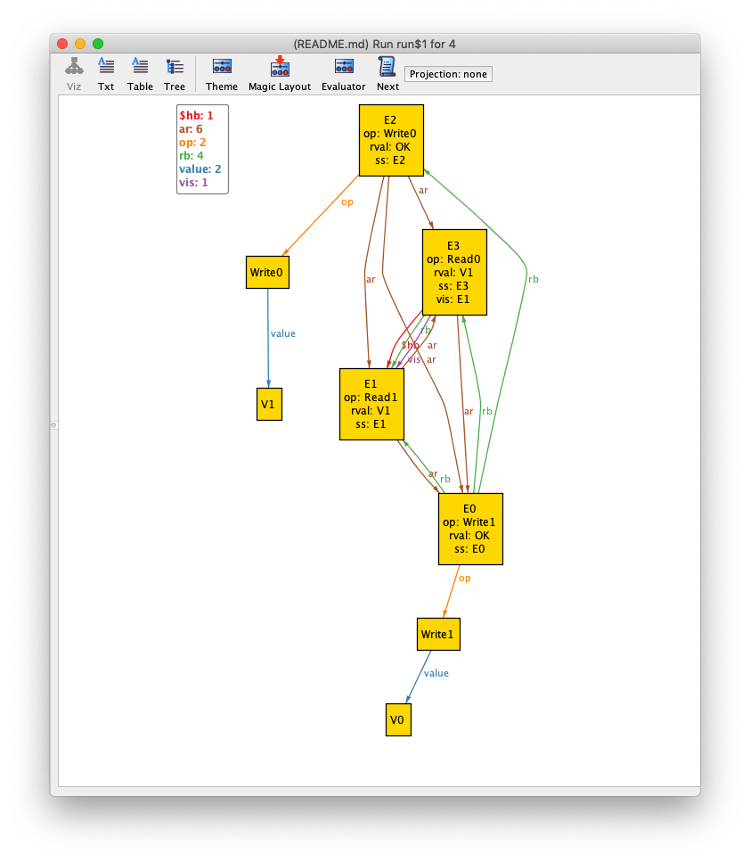
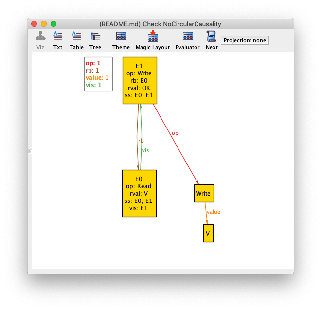

# Overview

In [Principles of Eventual Consistency][PoEC] (PoEC), Sebastian
Burckhardt introduces an approach for reasoning about eventually consistent data
types. When it comes to modeling concurrent or distributed algorithms, I've
historically looked to [TLA+], since it explicitly models time (the "T" is for temporal). 
Interestingly, Burckhardt's approach doesn't model time explicitly. Instead,
the approach uses *event graphs*, which are defined using sets, relations, and first order
logic.

This sounded like a good fit for the [Alloy modeling
language](http://alloytools.org/), which is designed for modeling using sets,
relations, and first order logic. This doc is me just playing with some of the
concepts in PoEC with Alloy.

Note that this file is written in [Alloy Markdown format](https://github.com/AlloyTools/org.alloytools.alloy/wiki/5.0.0-Change-List#markdown-syntax), so you can load it directly into [Alloy 5.0](https://github.com/AlloyTools/org.alloytools.alloy/releases).

[TLA+]: http://lamport.azurewebsites.net/tla/tla.html

# Using Alloy to model relations

Here's an example of how well suited Alloy is to Burckhardt's approach. On page 22 of PoEC, Burckhardt has a table properties of
binaries relations, along with their algebraic definitions. Translating from the algebraic definitions to Alloy syntax is very straightforward.


|Property    |Algebraic definition                          |Alloy syntax                       |
|------------|----------------------------------------------|-----------------------------------|
|symmetric   |rel=rel<sup>-1</sup>                          |`rel=~rel`                         |
|reflexive   |id<sub>A</sub> ⊆ rel                          |`iden & A->A in rel`               |
|irreflexive |id<sub>A</sub> ∩ rel = ∅                      |`no iden & rel`                    |
|transitive  |(rel;rel) ⊆ rel                               |`rel.rel in rel`                   |
|acyclic     |id<sub>A</sub> ∩ rel<sup>+</sup> = ∅          |`no iden & ^rel`                   |
|total       |rel ∪ rel<sup>-1</sup> ∪ id<sub>A</sub> = A×A |`A->A in rel + ~rel + iden`        |


[PoEC]: https://www.microsoft.com/en-us/research/publication/principles-of-eventual-consistency/


# Example: register


As our motivating example, we're going to use Alloy to model the behavior of a
register. A register is a very simple data structure that holds a single value.

A register supports two operations: *read a value* and *write a value*.

# Abstract executions

We'll use alloy to generate an *abstract execution* for a register. PoEC defines abstract executions
in section 3.2 (p34).

An abstract execution is made up of:

* *E* - set of events
* *op* - relation that maps events to operations
* *rval* - relation that maps events to values returned by the operation
* *rb* - "returns before" relation that captures which operations returned before which other ones
* *ss* - "same session" relation that captures which operations are part of the same session (you can think of it as a thread or process)
* *vis* - visibility relation
* *ar* - arbitration relation

The convention we'll use for return values is:

* For writes, the return value is `OK`
* For reads, the return value is either a legitimate value, or `Undef` if the register has never had a value written before:
* If an operation does not complete, the return value is `NeverReturns`.

# Modeling abstract executions in Alloy

In our alloy model, we'll define an *E* signature, and *op,rval,rb,ss,vis,ar* fields to model the relations.

I'd normally call this "Event" instead of "E", but I'll use "E" here to be
consistent with Burckhardt's syntax. 

## Events

```alloy
sig E {
    op: Operation,
    rval: Value + NeverReturns,
    rb: set E,
    ss: set E,
    vis: set E,
    ar: set E
}
```

Note how the *op* and *rval* relations map an event to an individual element of a set, and the other relations map an event to a set of events.

Next, we need to define *Operation, Value, Undef, OK*.

## Values

*Value* is just a set of values, it's the simplest possible definition of an Alloy signature:

```alloy
sig Value {}
```

We're going to define *V* as the values that can be written to the register.

```alloy
sig V extends Value {}
```

We'll also define *Undef* and *OK*, which we model as singleton sets:


```alloy
one sig Undef extends Value {}

one sig OK extends Value {}
```

Finally, we need to model with Burckhardt refers to as ∇, a special value that represents "NeverReturns".

```alloy
one sig NeverReturns {}
```

## Operations

To model operations, we need to model reads and writes. 

Writes have an argument, so we need a field on the *Write* signature that associates a write with a value.

```alloy
abstract sig Operation {}

sig Read extends Operation {}

sig Write extends Operation {
    value: V
}
```

## Constraints on relations

There are a number of constraints we need to enforce on some of the relations. In particular:

* *rb* (returns-before) is a partial order on *E* (Definition 3.1, p32).
* *ss* (same-session) is an equivalence relation on *E* (Definition 3.1, p32).
* *vis* (visibility) is an acyclic relation (Definition 3.3, p35).
* *ar* (arbitration) is a total order (Definition 3.3, p35).

```alloy
fact ReturnsBeforeIsPartialOrder {
    // Partial orders are irreflexive and transitive (Section 2.1.3, p21)

    // irreflexive
    no iden & rb

    // transitive
    rb.rb in rb
}

fact SameSessionIsAnEquivalenceRelation {
    // Equivalence relations are reflexive, transitive, and symmetric (Section 2.1.3, p22)

    // reflexive
    (iden & E->E) in ss

    // transitive
    ss.ss in ss

    // symmetric
    ss=~ss
}

fact VisibilityIsAcyclic {
    no iden & ^vis
}

fact ArbitrationIsTotalOrder {
    // total order is partial order and total
    // partial order is irreflexive and transitive
    // order defintion is in section 2.1.3

    // irreflexive
    no iden & & ar

    // transitive
    ar.ar in ar

    // total
    E->E in ar + ~ar + iden
}
```

## Register constraints

We need to constrain the return values so they match the operations.

* A write operation always returns *OK*
* A read operation returns either an ordinary value, or a special value, *Undef*, if it has not been intialized with a value.


```alloy
fact WritesReturnOK {
    all w : op.Write | w.rval = OK
}

fact ReadsReturnValuesOrUndef {
    all r : op.Read | r.rval in (Value + Undef)
}
```

We also add one last constraint, to capture the semantics of our register: a
read always corresponds to the last visible write in arbitration order, or
*Undef* if there is no visible write.

```alloy
fact ReadLastVisibleWrite {
    all r : op.Read | 
        some (op.Write & vis.r) => r.rval=lastVisibleWrite[r].op.value else r.rval=Undef
}

fun lastVisibleWrite(e: E): lone E {
    {w : op.Write | w->e in vis and no ww : op.Write | ww->e in vis and w->ww in ar}
}
```

## Other constraints

We don't want Alloy to generate any orphaned *Operation* instances, so we
specify that all operations have to be associated with an event.


```alloy
fact AllOpsAreAssociatedWithEvents {
    all o : Operation | some op.o
}
```

## Running the model

We can use Alloy to generate an instance of an abstract execution that meets these constraints:

I ran it with these settings:

```alloy
// Uncomment below to run it
// run {#Read>1 and #Write>1 and some vis} for 4
```

Here's what it generated:



I played with Alloy's theme settings so that the *op*, *rval*, and *ss* fields are shown as attributes.

# Ordering guarantees

Chapter 5 of PoEC expresses ordering guarantees as predicates on abstract executions. Here's a few of them:

```alloy
assert ReadMyWrites {
    so[] in vis
}

assert MonoticReads {
    vis.so[] in vis
}

assert ConsistentPrefix {
    ar.(vis-ss) in vis
}

assert NoCircularCausality {
    let so = rb & ss | 
    let hb = ^(so + vis) |
     no (iden & E->E & ^hb)   
}

assert CausalVisibility {
    hb[] in vis
}

assert CausalArbitration {
    hb[] in ar
}

assert RealTime {
    rb in ar
}

//
// convenience functions
//

// session order
fun so[]: E->E {
    rb & ss
}

// happens before
fun hb[]: E->E {
    ^(so[] + vis)
}
```

Unfortuantely, we can't check the *single order* guarantee with Alloy because that guarantee is
expressed in higher-order logic, and Alloy only supports expressions in first-order logic.

However, if we constrain things so that all operations complete, then we can define single order:

```alloy
fact AllOperationsComplete {
    no E.rval & NeverReturns
}

assert SingleOrder {
    vis = ar
}
```

## Checking for violations

We can use Alloy to check if these properties can be violated given the constraints we've put on our model:

```alloy
check NoCircularCausality
```

And, indeed, we get a counterexample:

.

The problem is:
* (E1,E0) is in *rb*, which means that E1 returned before E0
* (E0,E1) is in *vis*, which means that E0 is visible to E1
